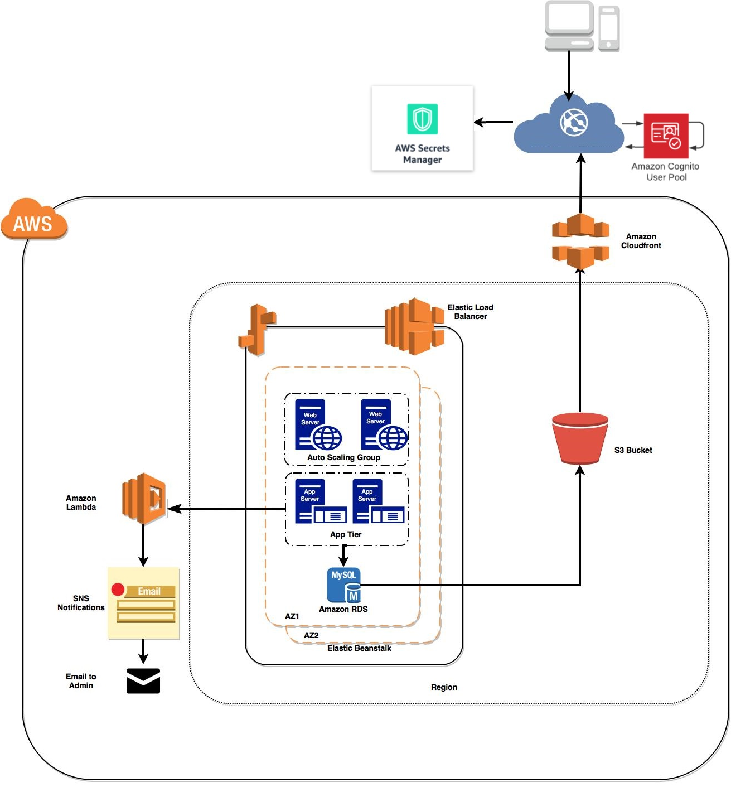

<div id="top"></div>

<br />
<div align="center">
  
<h3 align="center">Just Another Storage Service (JASS)</h3>

  <p align="center">
    Web application which serves the purpose of cloud storage facility to the potential users.
  </p>
</div>


<!-- TABLE OF CONTENTS -->
<details>
  <summary>Table of Contents</summary>
  <ol>
    <li>
      <a href="#about-the-project">About The Project</a>
      <ul>
		<li><a href="#features">Features</a></li>
		<li><a href="#architecture">Architecture</a></li>
        <li><a href="#built-with">Built With</a></li>
      </ul>
    </li>
    <li>
      <a href="#getting-started">Getting Started</a>
      <ul>
        <li><a href="#installation">Installation</a></li>
      </ul>
    </li>
    <li><a href="#contact">Contact</a></li>
  </ol>
</details>


<!-- ABOUT THE PROJECT -->
## About The Project

JASS (Just-Another-Storage-Service) is a web application which serves the purpose of cloud storage facility to the potential users. It supports different features to aid the functionality of basic file storing process. Prospected user can register the system via fresh email to use the various services of the application. Having the credentials, user can login with credentials. In the dashboard, user can mender around and explore various services. The application has multiple modules which deals with different features at multiple level to provide the integrated platform all together.
	
### Features

* User Authentication
* Manage Profile
	- Verify email
	- CRUD user
	- AUTH user
	- Reset password user
	- Route guard or permissions
* CRUD files with node.js and AWS S3
* File Sharing
	- Share files with permission to anyone or specify only persons to share with (by default it's none)
* File Versioning
* Viewing Supportable Files
	- View some format like image, doc, codes etc..
* Notification

### Architecture

<p align="center">
     
</p>

### Built With

(MERN + AWS)
* [MySQL](https://www.mysql.com/)
* [ExpressJS](https://expressjs.com/)
* [ReactJS](https://reactjs.org/)
* [NodeJS](https://nodejs.org/)
* [AWS](https://aws.amazon.com/)
* [NPM](https://docs.npmjs.com/downloading-and-installing-node-js-and-npm)
* [HerokuCLI](https://devcenter.heroku.com/articles/heroku-cli)
* [Axios](https://axios-http.com/docs/intro)
* [React Bootstrap](https://remotestack.io/react-bootstrap-login-register-ui-templates/)
* [Material-UI](https://mui.com/)
* [Font Awesome 5](https://www.w3schools.com/icons/fontawesome5_intro.asp)

#### AWS Services

* AWS EC2
* AWS S3
* AWS RDS
* AWS CloudFront
* AWS SNS
* AWS Elastic Load Balancing
* AWS Secrets Manager
* AWS Cognito
* AWS Lambda

<p align="right">(<a href="#top">back to top</a>)</p>


<!-- GETTING STARTED -->
## Getting Started

### Installation

1. Clone the repo
   ```sh
   git clone https://github.com/Patel-Parthkumar/Just-Another-Storage-Service.git
   ```
2. Change directory to the folder
   ```sh
   cd Backend
   ```
3. Install NPM packages
   ```sh
   npm install
   ```
3. Enter your keys in .env
4. Run the command npm run server to start Node.js + Express server, Server will start at localhost:5000
5. Change directory to the folder
   ```sh
   cd Frontend
   ```
6. Install NPM packages
   ```sh
   npm install
   ```
7. Enter your keys in .env
8. Run the command npm index.js to start React.js and Enjoy
   
<p align="right">(<a href="#top">back to top</a>)</p>


<!-- CONTACT -->
## Contact

Contributors Names

* Parthkumar Patel
* Jaiminkumar Jagjivanbhai Makasana

<p align="right">(<a href="#top">back to top</a>)</p>

